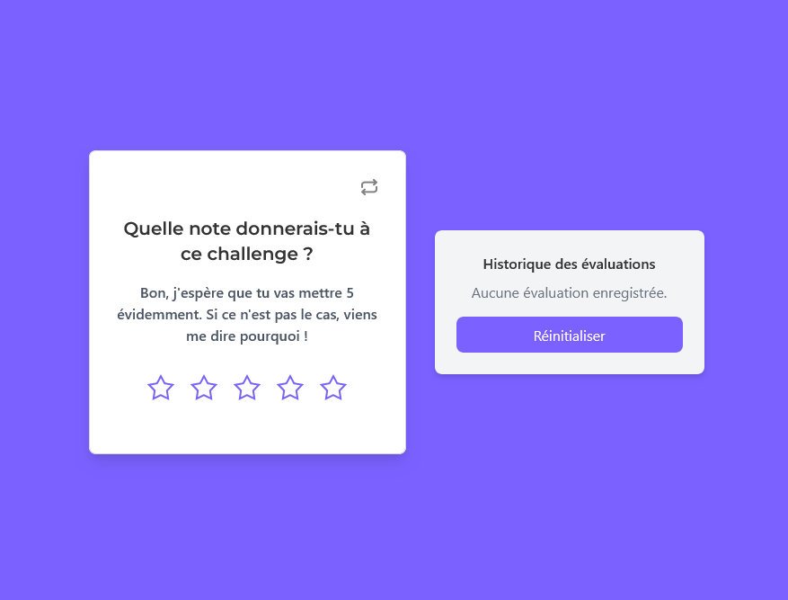

# (FR) Rating Cards Challenge - Semaine Spikes 

## Aperçu  


Cette semaine, on s'attarde sur ce petit **Spikes Challenge** de cartes de notation par étoiles,
contenant un historique des notes inscrites. Le but était d'implémenter une solution rapide de notation et de sauvegarde pour un projet de petit volume en NextJs.

## Fonctionnalités  

- 💾 **Sauvegarde des notes par LocalStorage** : Les notes données par l'utilisateur sont sauvegardées localement pour être conservées entre les sessions 
- 📜 **Affichage de l'historique des notes** : Une liste des notes précédemment données est affichée en temps réel  
- 🔄 **Bouton de réinitialisation** : Permet de remettre l'application à zéro pour recommencer à noter
- 🎨 **Design responsive** : L'applicatio possède une interface adaptative aux différents écrans grâce à Tailwind

### Démo en ligne  
👉 [](https://rating-cards-challenge.vercel.app/)  


<br><br><br><br><br><br><br><br><br>

# (EN) Rating Cards Challenge - Spikes Week  

## Overview  
  

This week, the focus is on this small **Spikes Challenge** of star rating cards,  
featuring a history of submitted ratings. The goal was to implement a quick rating and saving solution for a small-scale project using Next.js.  

## Features  

- 💾 **Save ratings in LocalStorage**: User ratings are stored locally to persist between sessions  
- 📜 **Display rating history**: There is a real-time list of previously submitted ratings  
- 🔄 **Reset button**: This reset button allows users to reset the application and start rating again
- 🎨 **Responsive design**: The app features a responsive interface adaptable to different screen sizes, thanks to Tailwind 

### Live Demo  
👉 [](https://rating-cards-challenge.vercel.app/)  


<br><br><br><br><br><br><br><br><br>


## Getting Started

First, run the development server:

```bash
npm run dev
# or
yarn dev
# or
pnpm dev
# or
bun dev
```

Open [http://localhost:3000](http://localhost:3000) with your browser to see the result.

You can start editing the page by modifying `app/page.tsx`. The page auto-updates as you edit the file.

This project uses [`next/font`](https://nextjs.org/docs/app/building-your-application/optimizing/fonts) to automatically optimize and load [Geist](https://vercel.com/font), a new font family for Vercel.

## Learn More

To learn more about Next.js, take a look at the following resources:

- [Next.js Documentation](https://nextjs.org/docs) - learn about Next.js features and API.
- [Learn Next.js](https://nextjs.org/learn) - an interactive Next.js tutorial.

You can check out [the Next.js GitHub repository](https://github.com/vercel/next.js) - your feedback and contributions are welcome!

## Deploy on Vercel

The easiest way to deploy your Next.js app is to use the [Vercel Platform](https://vercel.com/new?utm_medium=default-template&filter=next.js&utm_source=create-next-app&utm_campaign=create-next-app-readme) from the creators of Next.js.

Check out our [Next.js deployment documentation](https://nextjs.org/docs/app/building-your-application/deploying) for more details.
